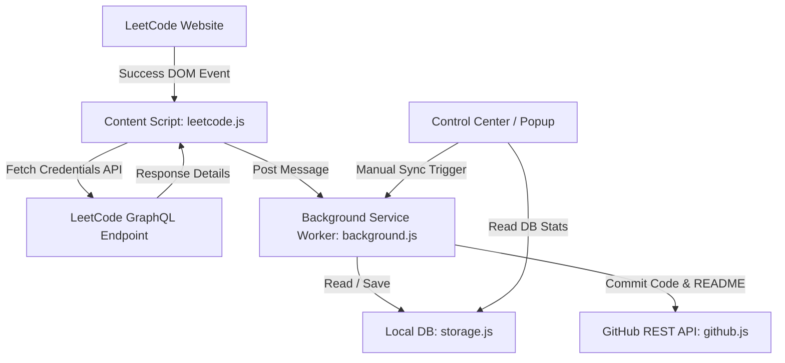
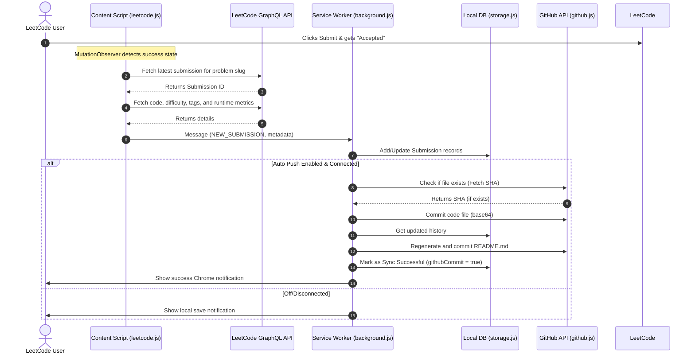

# LeetTrack Pro - Chrome Extension 🚀

**LeetTrack Pro** is a production-quality, modular Chrome Extension designed to automatically track accepted LeetCode submissions, parse detailed metadata, store them in a secure local database (`chrome.storage.local`), and synchronize them directly with a designated GitHub repository. 

It provides an interactive, full-screen **Control Center Dashboard** built with a dark glassmorphism aesthetic featuring progress metrics, topic analytics, heatmaps, search, personal notes, and contest tracking.

---

## 🏗 Extension Architecture & Components

```
LeetTrack Pro/
├── manifest.json            # MV3 configurations, permissions, background & content configurations
├── src/
│   ├── background/
│   │   └── background.js    # Service worker handling synchronization queues, alerts & triggers
│   ├── content/
│   │   └── leetcode.js      # MutationObserver and credentialed GraphQL parser running on leetcode.com
│   ├── github/
│   │   └── github.js        # GitHub REST client for commits, repository checks, and OAuth queries
│   ├── storage/
│   │   └── storage.js       # Wrapper around chrome.storage.local database operations
│   ├── utils/
│   │   └── utils.js         # Streak mathematics, language extensions, and README.md template generator
│   ├── assets/
│   │   ├── style/
│   │   │   └── common.css   # Global glassmorphism style rules & color palette variable tokens
│   │   └── icons/
│   │       ├── icon16.png
│   │       ├── icon32.png
│   │       ├── icon48.png
│   │       └── icon128.png
│   ├── popup/
│   │   ├── popup.html       # Popup view
│   │   ├── popup.css
│   │   └── popup.js
│   └── dashboard/
│       ├── dashboard.html   # Full screen Control Center Dashboard
│       ├── dashboard.css
│       └── dashboard.js
└── README.md
```

### Flow Architecture Diagram



### Submission Pipeline Sequence Diagram



---

## 🛠 Features

1. **Automatic Detection**: Observes submission updates using MutationObservers and verifies timestamps to eliminate wrong submissions, runtime errors, or duplicate syncing.
2. **Robust Scraping**: Inherits user cookies to query LeetCode's official GraphQL backend. Fetches exact code formatting, runtimes, memory usage, difficulty, and tag taxonomy.
3. **Glassmorphism Dashboard**: Custom full-screen dashboard matching high-end UI design systems. Includes dark mode support, transition animations, and circular stats.
4. **Heatmap & Gamification**:
   - Github-style 365-day submission heatmap grid.
   - Core topics completion progress bars matched against standard completion benchmarks.
5. **Interactive Note-Taking**: Directly edit space/time complexity estimations, approach writeups, common pitfalls, and revision toggles for any solved problem.
6. **Contest Tracker**: Fetch official contest ratings, global ranking thresholds, historical attendance numbers, and plots an interactive rating trend line graph via Chart.js.
7. **Safe Synchronization**: Checks file existence SHAs before rewriting, creates subdirectories (e.g. `LeetCode/Medium/0015_3Sum.cpp`), and updates repository `README.md` logs.
8. **Universal Data Exports**: Download entire local histories instantly as `JSON`, `CSV`, or a formatted `Markdown Portfolio` showing group difficulty files and codes.

---

## 📥 Installation Guide

Follow these steps to load the extension in Chrome:

1. **Clone or Download the Repository**:
   Download the files and make sure the folder structure resides in a clean directory on your drive (e.g. `r:\Leetcode-Track`).

2. **Open Extensions Page**:
   In Google Chrome, navigate to:
   ```
   chrome://extensions/
   ```

3. **Enable Developer Mode**:
   Toggle the **Developer mode** switch in the top-right corner of the window.

4. **Load Unpacked Extension**:
   - Click the **Load unpacked** button in the top-left corner.
   - Choose the root folder containing the `manifest.json` file (e.g., `Leetcode-Track`).

5. **Pin LeetTrack Pro**:
   Click the Extensions puzzle icon in the Chrome toolbar, locate **LeetTrack Pro**, and click the pin icon.

---

## 🚀 Setup & Usage Guide

1. **Create a GitHub Personal Access Token (PAT)**:
   - Go to your [GitHub Settings > Developer Settings > Personal Access Tokens > Tokens (classic)](https://github.com/settings/tokens).
   - Generate a new token with the `repo` scope selected.
2. **Configure the Extension**:
   - Click the extension popup icon in the toolbar, then click the **Dashboard** icon in the header (or click **Settings** after opening).
   - In the settings section, input your token and click **Verify & Load Repositories**.
   - Select your target repository from the dropdown or click **Create New Repo** to make a new private repo (e.g., `LeetCode-Solutions`) automatically.
3. **Start Coding**:
   - Solve any LeetCode problem. When your code gets **Accepted**, LeetTrack Pro instantly saves it locally and pushes it to GitHub, keeping your README stats updated.

---

## 🔒 Security & Performance Considerations

- **Secure Storage**: GitHub tokens and personal access tokens are stored in the private `chrome.storage.local` environment, which is sandboxed and never transmitted to third-party servers.
- **API Rate Limits**: The extension checks for file metadata before making commits to avoid redundant API request calls. All network operations are asynchronous, preventing UI freezes.
- **Robust Sync Queue**: If auto-push fails (e.g., due to network loss), the submission remains saved locally with a pending status. Clicking **Sync Now** in the popup or **Sync Repository** in the dashboard sweeps and uploads all uncommitted solutions.
